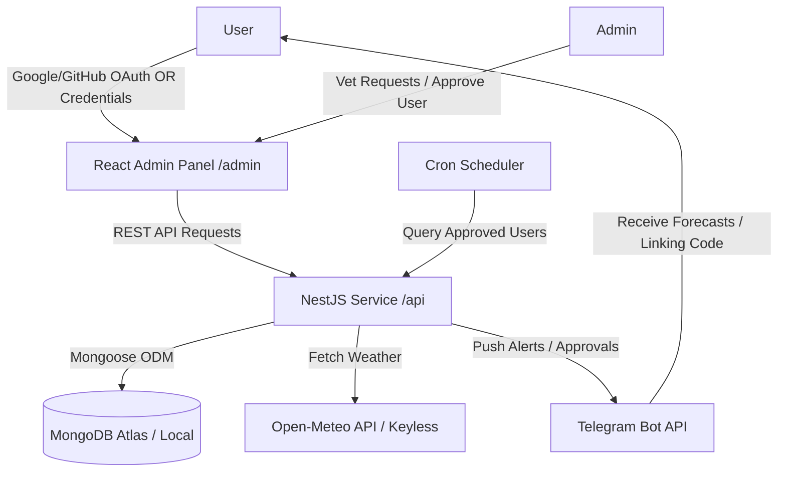

# WeatherGuard Admin — Secure Invite-Only Weather Alert Service

WeatherGuard Admin is a production-ready, secure, invite-only weather alert system that connects a responsive, glassmorphic React admin dashboard to an automated Telegram notification bot.

### 🚀 Live Deployed Links
* **Admin Dashboard (Frontend)**: [https://weatherguard-admin-0pdi.onrender.com](https://weatherguard-admin-0pdi.onrender.com)
* **REST API (Backend Service)**: [https://weatherguard-api-w7b9.onrender.com](https://weatherguard-api-w7b9.onrender.com)
  *(Visiting the root API endpoint returns a `200 OK` health check payload: `{ "status": "healthy", "service": "WeatherGuard Admin API", ... }`)*

---

## 🏗️ System Architecture & Data Flow



### 🔒 Access Control & Security Data Flow
To guarantee that **only "Approved" users receive weather notifications**, the system implements a strict multi-step verification pipeline:

1. **Authentication & Vetting State**:
   - Users sign up via Google or GitHub OAuth, or register with their Email/Password.
   - Upon registration, a MongoDB user document is created with `status: 'pending'` and a unique 6-character `telegramVerificationCode`.
   - Pending users are locked to a **Pending Portal screen** and cannot access dashboard metrics. Protected endpoints return a `403 Forbidden` response.
2. **Telegram Bot Handshake**:
   - The user opens the Telegram bot (`@WeatherAi47_bot`) and sends `/start <code>` or `/link <code>` using their 6-character verification code.
   - The NestJS API validates the code, links their active `telegramChatId` to the user's document, and responds with their pending status.
3. **Administrative Vetting**:
   - The Admin logs into the portal and views the Vetting Directory containing all signup requests.
   - Clicking **"Approve"** updates the user status to `approved`, which triggers an **instant welcome notification on Telegram**.
   - Clicking **"Revoke Access"** updates the user status to `rejected`, immediately halting alerts.
4. **Alert Dispatch Filter**:
   - The `SchedulerService` runs a cron task. It queries MongoDB using the filter:
     `{ status: 'approved', telegramChatId: { $exists: true, $ne: null } }`
   - Only users who are **both** Admin-Approved and Telegram-Linked have weather data fetched (using Open-Meteo) and alerts dispatched. If access is revoked, the scheduler automatically excludes them from the query.

---

## 🗄️ Database Schema (MongoDB / Mongoose)

We define a unified `User` model inside [user.model.ts](file:///c:/Users/user/ai47/api/src/db/models/user.model.ts):

```typescript
@Schema({ timestamps: true })
export class User {
  @Prop({ required: true, unique: true, index: true })
  email: string;

  @Prop({ required: true })
  name: string;

  @Prop()
  avatarUrl: string;

  @Prop({ select: false }) // Configured with select: false for password hashing security
  password?: string;

  @Prop({ required: true, enum: ['user', 'admin'], default: 'user' })
  role: string;

  @Prop({ required: true, enum: ['pending', 'approved', 'rejected'], default: 'pending' })
  status: string;

  @Prop({ unique: true, sparse: true })
  telegramChatId?: string;

  @Prop({ required: true, unique: true, index: true })
  telegramVerificationCode: string;

  @Prop({ default: 'New York' })
  location: string;
}
```

---

## 📂 Monorepo Architecture & Directory Structure

The codebase is organized as a clean monorepo divided into two modular projects. The backend groups files by controllers, services, database models, guards, and strategies in global directories matching production-grade architectures.

```
api/src/ (NestJS REST API)
├── db/
│   └── models/
│       └── user.model.ts          # Mongoose Schema & User document
├── controllers/
│   ├── app.controller.ts          # Exposes root GET / health check
│   ├── auth/
│   │   └── auth.controller.ts     # Exposes auth, local registration, & location routes
│   └── admin/
│       └── admin.controller.ts    # Exposes administrative vetting routes
├── services/
│   ├── auth/
│   │   └── auth.service.ts        # OAuth token generation & credentials login logic
│   ├── user/
│   │   └── users.service.ts       # Database CRUD queries & user management
│   ├── telegram/
│   │   └── telegram.service.ts    # Telegraf Bot wrapper & handshake listener
│   ├── weather/
│   │   └── weather.service.ts     # Keyless Open-Meteo Geocoding & Forecast connection
│   └── scheduler/
│       └── scheduler.service.ts   # Cron dispatch weather alert scheduler
├── guards/
│   ├── admin.guard.ts             # Admin-role REST endpoint guard
│   └── jwt-auth.guard.ts          # Passport JWT strategy route shield
└── strategies/
    ├── jwt.strategy.ts            # Passport JWT authorization setup
    ├── google.strategy.ts         # Google OAuth Passport strategy configuration
    └── github.strategy.ts         # GitHub OAuth Passport strategy configuration

admin/src/ (Vite React + Tailwind CSS)
├── components/
│   ├── Header.tsx / Footer.tsx   # Global navigation components
│   ├── LoginView.tsx              # Tabbed Sign In / Register (OAuth & Credentials)
│   ├── UserPortal.tsx             # Location picker (with autocomplete) & Telegram unlink
│   ├── AdminDashboard.tsx         # Directories table, statistics, & active system logs
│   └── StatusBadge.tsx            # Styled status label
├── hooks/
│   ├── useAuth.ts                 # State manager for logins, location, & unlinking
│   └── useAdmin.ts                # State manager for vetting directory & approvals
└── services/
    └── api.service.ts             # Axios/Fetch wrapper connecting to the NestJS API
```

---

## 🚀 Setup & Execution Guide

### 📋 Prerequisites
- **Node.js**: v18.0.0 or higher
- **MongoDB**: A running local MongoDB instance (`mongodb://localhost:27017`) or a MongoDB Atlas connection string.

---

### 1. Backend Service (`/api`)

1. Navigate to the backend directory:
   ```bash
   cd api
   ```
2. Install dependencies:
   ```bash
   npm install
   ```
3. Configure environment variables. Copy the example file and fill in your keys:
   ```bash
   cp .env.example .env
   ```
   - **`MONGODB_URI`**: MongoDB connection string.
   - **`JWT_SECRET`**: Random secure key used for signing JWTs.
   - **`TELEGRAM_BOT_TOKEN`**: Bot token from [@BotFather](https://t.me/BotFather).
   - **`FRONTEND_URL`**: URL of your frontend React dashboard (e.g. `http://localhost:5173`).
   - **`GOOGLE_CLIENT_ID` / `GOOGLE_CLIENT_SECRET`**: Google OAuth Web Client credentials.
   - **`GITHUB_CLIENT_ID` / `GITHUB_CLIENT_SECRET`**: GitHub OAuth Application credentials.

4. Launch the NestJS backend in development mode:
   ```bash
   npm run start:dev
   ```
   The backend will start on **`http://localhost:5000`**.

---

### 2. React Admin Dashboard (`/admin`)

1. Navigate to the frontend directory:
   ```bash
   cd admin
   ```
2. Install dependencies:
   ```bash
   npm install
   ```
3. Configure environment variables:
   Create a `.env` file in the `admin` root:
   ```env
   VITE_API_BASE=http://localhost:5000/api
   ```
4. Run the Vite development server:
   ```bash
   npm run dev
   ```
   The frontend will start on **`http://localhost:5173`**.

---

## 🧪 Vetting & Testing Walkthrough

1. **Register the Admin Account**:
   - Go to `http://localhost:5173`.
   - Go to **Email / Password** -> **Need access? Create an account**.
   - Sign up with `admin@weatherguard.com`. *Since this is the first registration, the system auto-promotes this account to Admin and approves it. You will see ONLY the Admin Dashboard.*
   - Log out.

2. **Register a Regular User**:
   - Sign up a new user via Google, GitHub, or Email/Password (e.g. `user@weatherguard.com`).
   - You will see the **Pending Approval** warning.
   - Start typing in the location input (e.g. `Berlin`) and select it from the geocoding suggestions dropdown to auto-save.
   - Copy the 6-character Telegram verification code. Log out.

3. **Telegram Link Handshake**:
   - Open Telegram and search for your bot (`@WeatherAi47_bot`).
   - Send `/start YOUR_CODE` or `/link YOUR_CODE` (e.g. `/start ABCXYZ`). The bot links your account.

4. **Vetting Approval**:
   - Log back in as `admin@weatherguard.com`.
   - Open the **Admin Panel**. Locate the user in the directory table, click **Approve**.
   - **Verify Telegram**: You will instantly receive a congrats message on Telegram! Every 30 seconds, weather alert cards are pushed containing live forecasts.

5. **Access Revocation & Unlinking**:
   - Admin can click **Revoke Access** on the directory table to suspend forecasts.
   - User can click **Disconnect Bot** on their portal to unlink their Telegram Chat ID, resetting their status and generating a new code.
