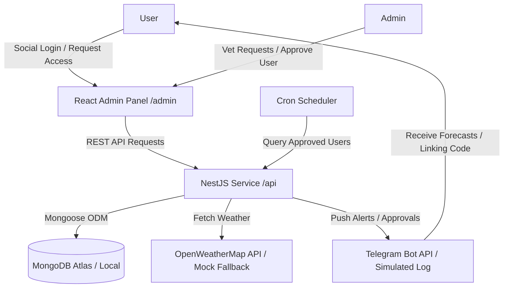

# WeatherGuard: Secure Invite-Only Weather Alert Service

WeatherGuard is a premium, secure, invite-only weather alert system that connects a responsive, glassmorphic admin dashboard to an automated Telegram notification bot.

---

## 🏗️ System Architecture & Data Flow



### 🔒 Access Control & Security Data Flow
To ensure **only "Approved" users receive weather alerts**, the system implements a strict multi-step verification pipeline:

1. **Registration & Vetting State**:
   - When a user signs in via Social Login, a MongoDB account is created with `status: 'pending'` and a unique 6-character `telegramVerificationCode`.
   - The user cannot view dashboard telemetry, modify settings, or access system alerts. They are restricted to a "Pending" screen.
   - Any attempt to query protected endpoints returns a `403 Forbidden` response.

2. **Telegram Handshake (Verification)**:
   - To link their account, the user sends `/start <code>` or `/link <code>` to the Telegram bot.
   - The bot matches this code in MongoDB and saves their `telegramChatId`.
   - If their status is still `pending`, the bot notifies them: *"Your registration is currently pending admin approval. We will alert you once verified."*

3. **Admin Verification**:
   - An administrator logs in and views all requests. Clicking **"Approve"** updates the user status to `approved`.
   - On status update, the backend queries if a `telegramChatId` exists. If so, a Telegram push notification is fired instantly, letting the user know they are approved.

4. **Alert Dispatch Filter**:
   - The scheduler cron runs periodically. It queries MongoDB using the filter:
     `{ status: 'approved', telegramChatId: { $exists: true, $ne: null } }`
   - Only users matching **both** criteria (Admin Approved + Telegram linked) have weather data fetched and notifications dispatched. If an admin rejects or suspends a user later, the status changes to `rejected`, immediately removing them from the scheduler query.

---

## 📂 Project Directory Structure

The backend adopts a layered architecture (similar to `Smartporters_backend`) where controllers, services, database models, guards, and strategies are organized into global directories.

```
api/src/
├── db/
│   └── models/
│       └── user.model.ts          # Mongoose Schema & User document
├── controllers/
│   ├── auth/
│   │   └── auth.controller.ts     # Exposes auth & location endpoints
│   └── admin/
│       └── admin.controller.ts    # Exposes administrative vetting routes
├── services/
│   ├── auth/
│   │   └── auth.service.ts        # Social login & token generation logic
│   ├── user/
│   │   └── users.service.ts       # Database CRUD queries
│   ├── telegram/
│   │   └── telegram.service.ts    # Telegraf Bot interface
│   ├── weather/
│   │   └── weather.service.ts     # OpenWeatherMap API connections
│   └── scheduler/
│       └── scheduler.service.ts   # Cron dispatch weather alert pushes
├── guards/
│   ├── admin.guard.ts             # REST route admin-role shield
│   └── jwt-auth.guard.ts          # JWT authentication passport shield
├── strategies/
│   └── jwt.strategy.ts            # Passport JWT Strategy config
├── app.module.ts                  # Integrates all database, cron, & routes
└── main.ts                        # Configures CORS, global prefix, & port
```

---

## 🗄️ Database Schema (MongoDB / Mongoose)

We define a unified `User` model inside `src/db/models/user.model.ts`:

```typescript
@Schema({ timestamps: true })
export class User {
  @Prop({ required: true, unique: true, index: true })
  email: string;

  @Prop({ required: true })
  name: string;

  @Prop()
  avatarUrl: string;

  @Prop({ required: true, enum: ['user', 'admin'], default: 'user' })
  role: string;

  @Prop({ required: true, enum: ['pending', 'approved', 'rejected'], default: 'pending' })
  status: string;

  @Prop({ unique: true, sparse: true })
  telegramChatId: string;

  @Prop({ required: true, unique: true, index: true })
  telegramVerificationCode: string;

  @Prop({ default: 'New York' })
  location: string;
}
```

---

## 🚀 Setup & Execution Guide

Follow these steps to run both the NestJS API backend and the React + Vite admin dashboard locally.

### 📋 Prerequisites
- **Node.js**: v18.0.0 or higher
- **MongoDB**: A running local MongoDB instance (`mongodb://localhost:27017`) or a MongoDB Atlas connection string.

---

### 1. Backend Service (`/api`)

1. Navigate to the backend directory:
   ```bash
   cd api
   ```
2. Install dependencies:
   ```bash
   npm install
   ```
3. Configure environment variables. Copy the example file and fill in your keys:
   ```bash
   cp .env.example .env
   ```
   - **`MONGODB_URI`**: Set to your MongoDB connection string (defaults to local MongoDB).
   - **`JWT_SECRET`**: Key used for signing JWTs.
   - **`TELEGRAM_BOT_TOKEN`**: Obtain this by messaging [@BotFather](https://t.me/BotFather) on Telegram and creating a new bot. *If left blank, the bot will run in a simulated mode logging messages to the terminal.*
    - **`OPENWEATHER_API_KEY`**: Optional. If left blank, the backend automatically integrates with the keyless **Open-Meteo Weather & Geocoding APIs** to query real-time, live weather details for any city typed!

4. Launch the NestJS backend in development mode:
   ```bash
   npm run start:dev
   ```
   The backend will start on **`http://localhost:5000/api`**.

---

### 2. React Admin Dashboard (`/admin`)

1. Navigate to the frontend directory:
   ```bash
   cd admin
   ```
2. Install dependencies:
   ```bash
   npm install
   ```
3. Run the Vite development server:
   ```bash
   npm run dev
   ```
   The frontend will start on **`http://localhost:5173`**.

---

## 🧪 Vetting & Testing Guide

Once you have configured the database and social OAuth keys, run the testing sequence:

1. **Register the Administrator**:
   - Open **`http://localhost:5173`**.
   - Click **"Sign up / Log in with Google"** (or GitHub) to register.
   - *Note:* The first user registered in a clean MongoDB database is **auto-promoted to Admin and Approved** to prevent lockouts.
   - Click the logout button in the header.

2. **Register a Regular User**:
   - Authenticate with a different Google or GitHub account.
   - Since they are not the first user, their request will be marked as **Pending Approval**.
   - Copy their **6-digit Telegram Verification Code** (e.g. `ABCXYZ`).

3. **Telegram Handshake**:
   - Open your Telegram bot and send `/start ABCXYZ` (or `/link ABCXYZ`) to link the user's `telegramChatId` to their request profile.

4. **Vetting & Approving**:
   - Log back in as the Admin (your first account).
   - Click **"Admin Panel"** in the top right header.
   - Locate the pending user in the table and click **"Approve"**.
   - The user will immediately receive a congratulations alert on Telegram!
   - Every 30 seconds, the cron scheduler fetches live weather for the user's configured location and pushes forecasts.
